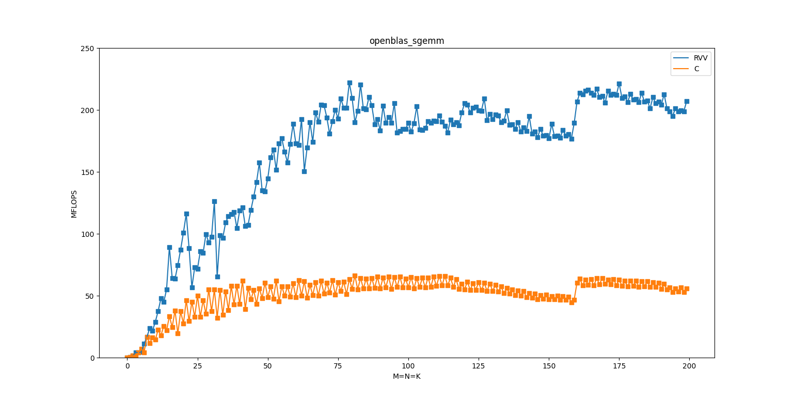

# OpenBLAS been Optimized with Nuclei VPU


## Introduction

OpenBLAS is an optimized BLAS (Basic Linear Algebra Subprograms) library based on GotoBLAS2 1.13 BSD version.

Please read the documentation on the OpenBLAS wiki pages: <https://github.com/xianyi/OpenBLAS/wiki>.

Nuclei corp. provide VPU version in order to inprove OpenBLAS performance.

## Download Source

Download Source from  https://github.com/Nuclei-Software/OpenBLAS

```sh
# branch nuclei_rvv
git clone --branch nuclei_rvv https://github.com/Nuclei-Software/OpenBLAS.git
```

### Dependencies

Building OpenBLAS (with Nuclei VPU Optimized) requires the following to be installed:

* GNU Make
* GNU GCC
* Nuclei linux binutils, Download from  https://www.nucleisys.com/upload/files/nuclei_riscv_glibc_prebuilt_linux64_2022.04.tar.bz2
* Nuclei openocd (If you want to run in hardward supported by Nuclei, need openocd), Download from https://nucleisys.com/download.php#tools

### Cross compile for Nuclei RISC-V CPU

Set `CC` to point to the cross toolchains, and set `HOSTCC` to your host C compiler.
The target must be specified explicitly when cross compiling.

```sh
# step1: Download and set cross toolchains path, check whether the command is correct
riscv-nuclei-linux-gnu-gcc -v

# step2: Build openblas lib(with RVV)
make HOSTCC=gcc TARGET=UX900FD ARCH_EXT=v CC=riscv-nuclei-linux-gnu-gcc NOFORTRAN=1 NO_SHARED=1 USE_THREAD=0 NO_LAPACK=1 USE_OPENMP=0 CFLAGS=-static BINARY=64
# or no RVV
make HOSTCC=gcc TARGET=UX900FD ARCH_EXT= CC=riscv-nuclei-linux-gnu-gcc NOFORTRAN=1 NO_SHARED=1 USE_THREAD=0 NO_LAPACK=1 USE_OPENMP=0 CFLAGS=-static BINARY=64 HAS_RVV=0

# step3: Install lib, the libopenblas.a is located in ${OPENBLAS_ROOT}/prefix
cd OpenBLAS
export OPENBLAS_ROOT=$(readlink -f ../OpenBLAS)
make HOSTCC=gcc TARGET=UX900FD CC=riscv-nuclei-linux-gnu-gcc NOFORTRAN=1 NO_SHARED=1 USE_THREAD=0 NO_LAPACK=1 USE_OPENMP=0 CFLAGS=-static BINARY=64 PREFIX=${OPENBLAS_ROOT}/prefix install

# step4：Compile utest && ctest && benchmark(optional)
cd utest
make HOSTCC=gcc TARGET=UX900FD CC=riscv-nuclei-linux-gnu-gcc NOFORTRAN=1 NO_SHARED=1 NO_LAPACK=1 USE_THREAD=0 USE_OPENMP=0 CFLAGS=-static BINARY=64 all

cd ctest
make HOSTCC=gcc TARGET=UX900FD CC=riscv-nuclei-linux-gnu-gcc NOFORTRAN=1 NO_SHARED=1 NO_LAPACK=1 USE_THREAD=0 USE_OPENMP=0 CFLAGS=-static BINARY=64 all

cd benchmark
make HOSTCC=gcc TARGET=UX900FD CC=riscv-nuclei-linux-gnu-gcc NOFORTRAN=1 NO_SHARED=1 NO_LAPACK=1 USE_THREAD=0 USE_OPENMP=0 CFLAGS=-static BINARY=64 all
```

In addition, here is a scrit to run above process，at first, you should finished download Source and config cross toolchains , then execute as follows:

```sh
cd OpenBLAS
source nuclei_run.sh

# Then, you should make a choice
# enter 1 or other means: use VPU opt
# enter 2: means no VPU opt

# Then, enter to continue build
```

### How to configure examples

```sh
# step1: Coding do myself or download examples from https://gist.github.com/xianyi/
# For example: download time_clbas_dgemm.c from https://gist.github.com/xianyi/

# step2: Compile with libopenblas.a
riscv-nuclei-linux-gnu-gcc -o time_clbas_dgemm time_clbas_dgemm.c -I${OPENBLAS_ROOT}/prefix/include/ ${OPENBLAS_ROOT}/prefix/lib/libopenblas.a -static

# step3: Test executable file on HW board
# You need to put executable file(here is time_clbas_dgemm) in SDcard and boot linux on Nuclei HW platform

# Q: How to Boot linux from SDcard on Nuclei HW platform ?
# A: Reference: https://github.com/Nuclei-Software/nuclei-linux-sdk/README.md
#    Note: Only dev_nuclei_5.18 support rvv, you need to checkout branch dev_nuclei_5.18

# Q: How to run executable file on Nuclei HW platform ?
# A: Reference: https://github.com/Nuclei-Software/nuclei-linux-sdk/README.md, and read the chapter (Put prebuilt applications into SDCard)

# Waiting for linux boot and mount SDcard
mount -t vfat /dev/mmcblk0p1 /mnt
cd /mnt
./time_clbas_dgemm
```

## Data performance

We can measure Openblas performance use benchmark. Here is the performance on Nuclei FPGA Evaluation Board（SOC=UX900fd VPU freq = 100MHz）

**Compile benchmark**

```sh
cd benchmark
make HOSTCC=gcc TARGET=UX900FD CC=riscv-nuclei-linux-gnu-gcc NOFORTRAN=1 NO_SHARED=1 NO_LAPACK=1 USE_THREAD=0 USE_OPENMP=0 CFLAGS=-static BINARY=64 all

mkdir goto
mv *.goto goto
cd goto && ls

# Here are all benchmark executable files
camax.goto   cger.goto    cscal.goto   ctrmv.goto   ddot.goto   dscal.goto   dsyr.goto    icamax.goto  ismin.goto   scopy.goto  srotm.goto  ssyr2k.goto  zamax.goto   zgemv.goto   zhpmv.goto   ztrmv.goto
camin.goto   chbmv.goto   csrot.goto   ctrsm.goto   dgemm.goto  dspmv.goto   dsyrk.goto   icamin.goto  izamax.goto  sdot.goto   sscal.goto  ssyr.goto    zamin.goto   zger.goto    zscal.goto   ztrsm.goto
casum.goto   chemm.goto   cswap.goto   ctrsv.goto   dgemv.goto  dspr2.goto   dtpmv.goto   idamax.goto  izamin.goto  sgemm.goto  sspmv.goto  ssyrk.goto   zasum.goto   zhbmv.goto   zswap.goto   ztrsv.goto
caxpby.goto  chemv.goto   csymm.goto   damax.goto   dger.goto   dspr.goto    dtpsv.goto   idamin.goto  samax.goto   sgemv.goto  sspr2.goto  stpmv.goto   zaxpby.goto  zhemm.goto   zsymm.goto
caxpy.goto   cher2.goto   csyr2k.goto  damin.goto   dmax.goto   dswap.goto   dtrmm.goto   idmax.goto   samin.goto   sger.goto   sspr.goto   stpsv.goto   zaxpy.goto   zhemv.goto   zsyr2k.goto
ccopy.goto   cher2k.goto  csyrk.goto   dasum.goto   dmin.goto   dsymm.goto   dtrmv.goto   idmin.goto   sasum.goto   smax.goto   sswap.goto  strmm.goto   zcopy.goto   zher2.goto   zsyrk.goto
cdot.goto    cher.goto    ctpmv.goto   daxpby.goto  dnrm2.goto  dsymv.goto   dtrsm.goto   isamax.goto  saxpby.goto  smin.goto   ssymm.goto  strmv.goto   zdot.goto    zher2k.goto  ztpmv.goto
cgemm.goto   cherk.goto   ctpsv.goto   daxpy.goto   drot.goto   dsyr2.goto   dtrsv.goto   isamin.goto  saxpy.goto   snrm2.goto  ssymv.goto  strsm.goto   zdrot.goto   zher.goto    ztpsv.goto
cgemv.goto   chpmv.goto   ctrmm.goto   dcopy.goto   drotm.goto  dsyr2k.goto  dznrm2.goto  ismax.goto   scnrm2.goto  srot.goto   ssyr2.goto  strsv.goto   zgemm.goto   zherk.goto   ztrmm.goto
```

**Test data**

Here is performance figure when execute sgemm.goto on Nuclei FPGA Evaluation Board（SOC=UX900fd VPU freq = 100MHz）, We can see performance improved 4x if use VPU opt.



And other data (Single precision Floating-point tests ) as follows:

Note: for the convenience of presentation, we only select the data in step 200

| Benchmark   | no VPU (MFlops) | VPU (MFlops) |
| ----------- | --------------- | ------------ |
| samax.goto  | 8.74            | 26.21        |
| samin.goto  | 8.74            | 26.08        |
| sasum.goto  | 3.28            | 13.11        |
| saxpby.goto | 6.52            | 19.27        |
| saxpy.goto  | 4.37            | 13.11        |
| scnrm2.goto | 8.74            | 52.43        |
| scopy.goto  | 26.21           | 26.21        |
| sdot.goto   | 13.11           | 13.11        |
| sgemm.goto  | 55.92           | 207.15       |
| saxpby.goto | 9.83            | 19.66        |
| scnrm2.goto | 7.49            | 52.43        |
| sgemv.goto  | 13.31           | 31.21        |
| sger.goto   | 9.67            | 26.75        |
| smax.goto   | 13.11           | 25.30        |
| smin.goto   | 13.11           | 25.82        |
| snrm2.goto  | 4.37            | 13.11        |
| srot.goto   | 39.32           | 39.32        |
| srotm.goto  | 13.11           | 19.66        |
| sscal.goto  | 3.28            | 6.55         |
| sspmv.goto  | 10.04           | 19.28        |
| sspr.goto   | 9.93            | 24.73        |
| sspr2.goto  | 10.88           | 36.41        |
| sswap.goto  | 26.21           | 26.21        |
| ssymm.goto  | 52.56           | 203.84       |
| ssymv.goto  | 13.17           | 39.72        |
| ssyr.goto   | 9.71            | 25.21        |
| ssyr2.goto  | 11.06           | 34.49        |
| ssyr2k.goto | 50.82           | 190.65       |
| ssyrk.goto  | 48.22           | 167.72       |
| stpmv.goto  | 10.24           | 26.21        |
| stpsv.goto  | 10.16           | 25.70        |
| strmm.goto  | 50.78           | 184.22       |
| strmv.goto  | 11.70           | 29.13        |
| strsm.goto  | 49.31           | 133.00       |
| strsv.goto  | 10.24           | 22.60        |
